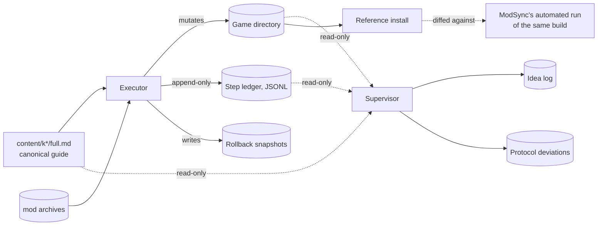

# Contributing to ModSync

ModSync is a cross-platform mod installer for Star Wars: KOTOR I and II, built with .NET 9 and AvaloniaUI. This file covers how to get set up, how to submit changes, and — the part most projects skip — how we actually know the installer works.

## Quick start

```bash
# Build
dotnet build ModSync.sln --configuration Debug

# Run the GUI
dotnet run --project src/ModSync.GUI/ModSync.csproj --configuration Debug --framework net9.0

# Run the fast test suite
dotnet test src/ModSync.Tests/ModSync.Tests.csproj --filter "FullyQualifiedName!~LongRunning" --configuration Debug

# Format check
dotnet format ModSync.sln --verify-no-changes
```

Full command reference, project layout, and agent-routing detail live in [`CLAUDE.md`](CLAUDE.md) and [`AGENTS.md`](AGENTS.md). Read those before your first PR — this file assumes you already have a build running.

## Making a change

1. Branch off `master`.
2. Keep the change scoped — one fix or one feature per PR. Don't bundle unrelated cleanup.
3. Add or update tests for anything you touch in `src/ModSync.Core` or `src/ModSync.GUI`. `src/ModSync.Tests` is the single test project; don't create a new one.
4. Run the fast suite locally before opening the PR (`dotnet test ... --filter "FullyQualifiedName!~LongRunning"`). Tests over two minutes carry a `LongRunning` suffix and are excluded from that filter — see `docs/knowledgebase/README.md` for the full test-naming convention.
5. `dotnet format ModSync.sln --verify-no-changes` before pushing.
6. GitHub Releases are manual only — don't expect a tag or release from merging to `master`. See `docs/manual-release.md`.

If your change touches the install wizard, `ValidatePage`, or anything under `src/ModSync.GUI/Dialogs/WizardPages`, read [`docs/knowledgebase/gui-validation-surfaces.md`](docs/knowledgebase/gui-validation-surfaces.md) first — the validation UI has surfaces that are easy to break silently.

## How we validate ModSync: manual-parity testing

Unit tests check that individual pieces of code do what they claim. They don't check that ModSync, run end-to-end against a real build guide, lands the same files a careful human would. That gap is where the interesting bugs live — a registry silently discarding a mutation, a component list that reports "loaded" while being empty, a patcher that exits 0 after writing an error to its own log. None of those trip a unit test. All of them trip a byte-for-byte comparison against a real install.

So periodically — and always before trusting a big change to the install/validation path — we run the build guide **by hand**, twice over, with two independent agents:

| | Executor | Supervisor |
|---|---|---|
| Mutates the game directory | Yes | Never |
| Reads the guide | Yes — the guide is the only source of truth, never ModSync's own instruction TOML | Yes, to judge whether the executor followed it |
| Output | Append-only step ledger + a reference install | Idea log + protocol-deviation reports |
| Tools | Full filesystem access, patcher execution | Read-only |
| Fails the run when | A step can't be completed *or* rolled back | The executor silently deviated from the guide |

The executor installs one build (`content/k1/full.md` or `content/k2/full.md`) into a fresh, vanilla game copy, one mod at a time, exactly as written — no shortcuts, no consulting ModSync's own TOML (which would just mean testing the TOML against itself). Before every step it takes a rollback point; after every step it verifies the mutation actually matches what the step claimed, and only then writes a `pass` to the ledger. Any step that can't be verified is a failed step, full stop — there's no partial credit.

The supervisor never touches the game directory. It watches the ledger and the guide side-by-side and writes down every place a human — or ModSync's UI — would have to guess, backtrack, or get lucky. Those observations become dated product proposals, not vague "UX could be better" notes.



The diff between the manual reference install and ModSync's automated run of the same build is the actual output of the exercise — anything present in one and not the other, or differing in content, is a real finding.

The full protocol — tiered snapshot strategy, exact patcher pass/fail criteria, step-ledger schema, per-step state machine — is documented in [`docs/knowledgebase/manual-parity-testing-methodology.md`](docs/knowledgebase/manual-parity-testing-methodology.md). Read that before running one of these yourself; it's the part worth getting right, since a rollback that doesn't verify isn't a rollback.

### What this looks like in practice

The two most recent full runs, K1 (`content/k1/full.md`, 197 steps) and K2 (`content/k2/full.md`, 154 steps), give a concrete sense of scale and what actually gets caught:

| | K1 | K2 |
|---|---|---|
| Total guide steps | 197 | 154 |
| Installed clean | 171 | 139 |
| Blocked (documented root cause) | 10 | 8 |
| Skipped (explicit safety rationale) | 9 | 7 |
| Scope gaps (archive never downloaded) | included above | included above |

Every one of the non-`pass` entries has a written reason tied to either the guide's own text or a reproduced tooling failure — "guide marks this Optional, we're not using it" and "archive never downloaded, confirmed absent" are both valid `blocked`/`skipped` records; "didn't feel like it" is not a category that exists.

Findings from these two runs that a passing test suite did not surface, and that came directly out of this process:

- **`HoloPatcher_linux` resolves an `Override`-existence check against the process's current working directory, not `--game-dir`.** Invoked from the wrong CWD, it polls a wrong-but-existing path in a ~4ms loop forever, with zero output and zero timeout — indistinguishable from "still working" until you strace it. Any code path that shells out to this binary must control CWD explicitly.
- **`--console` does not guarantee non-interactive HoloPatcher operation — it can hang forever on an unhandled exception dialog.** Three mods blocked indefinitely under `--install`. Screenshotting the modal dialog (the parent window alone isn't enough — the modal is a separate child window, so capture the root window) showed two distinct unhandled exceptions, each of which pops a Tk message box and blocks with no timeout and nothing useful on stdout:
  - **`KeyError` on a missing `namespaces.ini` key.** HoloPatcher hard-requires `IniName`, `InfoName`, and `Description` per namespace section; real TSLPatcher treats them as optional and defaults them. One mod omitted `IniName`/`InfoName`, two omitted `Description`. Supplying the missing keys fixed all three.
  - **`AttributeError: module 'ctypes' has no attribute 'windll'`** at `utility/tkinter/rte_editor.py` line 13 — an unguarded Windows-only call executed at *import* time. The module is imported whenever a namespace's `InfoName` is a `.rte` file, even though nothing in the patching path needs it. Converting `.rte` info files to `.rtf` avoids the import entirely. This is a one-line platform guard away from being fixed upstream.
- **The GFF section parser is order-sensitive.** A section that appends a Struct to a list and ends with the TSLPatcher directive `2DAMEMORY<n>=ListIndex` *after* its `AddField0..N` keys makes the parser misroute that value into `TypeId`, aborting with `Invalid TypeId: expected int but got 'ListIndex'`. Real TSLPatcher is order-insensitive. Moving the directive to immediately after the section header turned a 0-patch abort into a clean 580-patch install.
- **NSS scripts containing `#2DAMEMORY` / `#StrRef` tokens cannot be compiled from raw source.** These tokens are substituted by the patcher with real 2DA row indices before compilation, so an external compiler run against the shipped `.nss` fails with `Syntax error at "DAMEMORY4"`. When HoloPatcher's own bundled Unix compiler then crashes (`'str' object has no attribute 'info'`), the recovery is to set `SaveProcessedScripts=1`, let the patcher emit its token-substituted copies to `temp_nss_working_dir`, and compile *those* with the mod's bundled `nwnnsscomp.exe` under wine. Note the processed-scripts directory is created under the namespace's `DataPath`, not always at the tslpatchdata root. This recovered 18 scripts across 7 mods that had previously been written off as unfixable.
- **A registry class silently discarded mutations**, making backups appear to succeed while writing nothing (fixed in `26fdab9e`) — caught because the manifest diff showed files the ledger claimed had changed hadn't.
- **A merged build TOML's components were largely empty or unreviewed** while reporting a full component count — caught by the supervisor cross-checking the guide's actual mod list against what ModSync's own instruction file claimed to contain.
- **K2's Aspyr native Linux port has a different game-directory layout than K1's Steam/Windows build**, and it isn't obvious from the top level: the actual `override`, `modules`, `dialog.tlk`, and `chitin.key` live under a `steamassets/` subfolder, not at the install root. Code (or an agent) that reuses K1's "top-level `Override/`" assumption for K2 will silently look in the wrong place. Any full-build tooling that needs to work across both games has to detect this rather than hardcode one layout.
- **A mod family that produces empty-but-referenced `.nss` scripts and fails HoloPatcher's built-in Unix compiler can be recovered without a Windows machine**: run the mod's own bundled `nwnnsscomp.exe` under `wine`, then copy the resulting `.ncs` into the game's override directory by hand, at the exact path the mod's own `changes.ini` specifies. Confirmed on the same mod family (`Alignment Affects Force Powers`) in both games — K1's copy needed 3 scripts recompiled this way, K2's needed 4 (K2's build adds a third heal-tier script K1's doesn't have). This is the concrete workaround for the `--console` GUI-hang class above, when the failure is a compiler crash rather than a stuck dialog.
- Lower-severity but still real: `7z` failing to open a valid RAR5 archive that `unrar` opens fine; a pre-extracted mod folder that was silently empty from an earlier download pass, recovered only because a duplicate archive happened to exist alongside it; Windows-mod archives mixing filename case in ways that break naive case-sensitive matching on Linux.

None of these are exotic. They're the ordinary failure modes of "a lot of small file operations happen in a specific order," and they only show up when something actually walks that order end-to-end and checks its work at every step.

### Running one yourself

Don't start without:

- **Exactly one game install on the machine.** TSLPatcher auto-detects the game directory and will happily patch the wrong copy if more than one exists.
- **A verified vanilla baseline** — checked by file count and `chitin.key` presence, not assumed.
- **Archives staged and integrity-checked before the run starts.** A Cloudflare challenge page saved as `mod.zip` is a few KB and extracts to nothing; catching that at step 140 wastes the whole run.
- **Filesystem capability checked.** Hardlink/reflink support determines which snapshot tier is cheap; exFAT forces full copies for everything.

See `docs/knowledgebase/manual-parity-testing-methodology.md` for the rest, including the exact patcher pass/fail decision tree and the step-ledger JSON schema.

## Where to go next

- **Agent-specific routing and full command reference:** [`CLAUDE.md`](CLAUDE.md), [`AGENTS.md`](AGENTS.md)
- **Knowledgebase index:** [`docs/knowledgebase/README.md`](docs/knowledgebase/README.md)
- **Install wizard validation surfaces:** [`docs/knowledgebase/gui-validation-surfaces.md`](docs/knowledgebase/gui-validation-surfaces.md)
- **Full manual-parity protocol:** [`docs/knowledgebase/manual-parity-testing-methodology.md`](docs/knowledgebase/manual-parity-testing-methodology.md)
