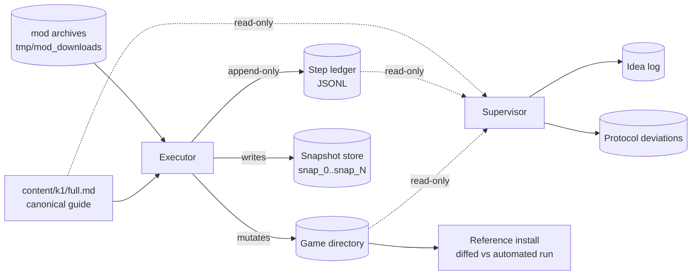
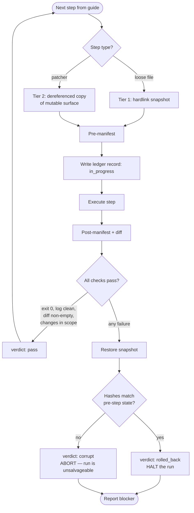
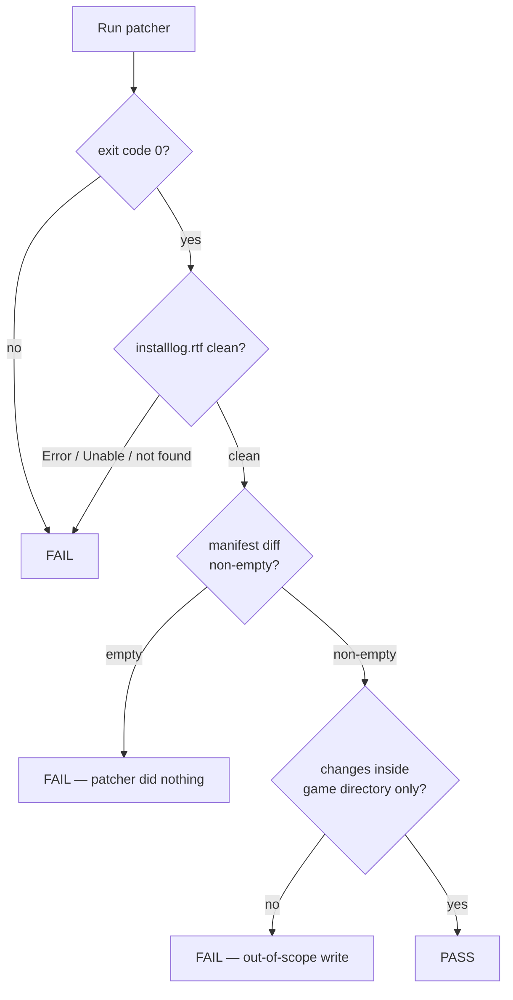
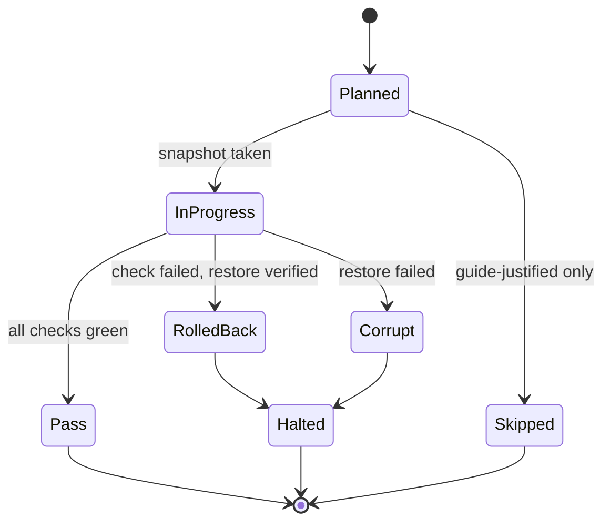

# Manual-Parity Testing Methodology

How we validate ModSync against a human install.

## Why this exists

ModSync automates a mod build that humans otherwise install by hand, one mod at a
time, following a written guide. Automation is only correct if it lands the same
bytes in the same places as a careful human following that same guide.

So we test by doing both and comparing. One agent installs a build by hand,
exactly as the guide instructs, with no ModSync involvement. Another agent watches
and writes down every place the manual process was painful, because that pain is
the specification for ModSync's UX.

This produces three artifacts per run:

1. A **reference install** — a known-good game directory the automated run can be diffed against.
2. A **step ledger** — an append-only record of every mutation, with rollback points.
3. An **idea log** — observed friction, generalized into product proposals.

## The two roles

| | Executor | Supervisor |
|---|---|---|
| Mutates the game directory | Yes | Never |
| Reads the guide | Yes, as the source of truth | Yes, to judge whether the executor followed it |
| Output | Step ledger + reference install | Idea log + protocol deviations |
| Tools | Full filesystem + patcher execution | Read-only |
| Fails the run when | A step cannot be completed or rolled back | The executor silently deviated from the guide |

Splitting these matters. An agent that both installs and evaluates will
rationalize its own shortcuts. The supervisor has no stake in the install
finishing, so it is free to say "that step was skipped and the log does not
mention it."

---

## Executor protocol

### Ground rules

1. **Follow the guide, not the TOML.** The executor reads `content/k1/full.md`
   directly. If it consults ModSync's TOML it inherits the TOML's bugs, and the
   run stops being an independent check.
2. **Never edit a file in place.** Every write is "write to temp, then rename over
   the target." Plain `cp` over an existing file mutates the inode and corrupts
   every hardlink snapshot pointing at it. Use `rsync`, `install`, or
   `cp --remove-destination`.
3. **One step, one ledger record.** No batching. A step that touched 400 files is
   still one record, but two mods are never one step.
4. **A step that cannot be verified is a failed step**, not a passed one.

### Tiered snapshots

Full copies per step are impossible (~190 steps × 3.6 GB). Instead, snapshot cost
scales with what actually changed.

**Tier 0 — manifest, every step.** Before and after each step, record
`path, size, mtime` for the whole tree, plus `sha256` for files whose size or
mtime moved. Cheap (a stat sweep), and it is what tells you what a step *actually*
did versus what it claimed to do.

**Tier 1 — hardlink snapshot, every loose-file step.**

```
rsync -a --delete --link-dest=../snap_$((N-1)) game/ snap_$N/
```

Unchanged files become hardlinks, so a snapshot of a 3.6 GB tree where 8 MB
changed costs 8 MB. This is safe **only** because of ground rule 2: loose-file
steps add or replace whole files, and a rename-into-place gives the live tree a
new inode while the snapshot keeps the old one.

**Tier 2 — dereferenced copy, before every patcher run.**

```
cp -a --dereference  # or: rsync -a --copy-links
```

TSLPatcher and HoloPatcher **edit files in place**: they rewrite `.2da` rows,
append to `dialog.tlk`, and patch `.mod`/`.erf` archives. An in-place write
through a hardlink changes the snapshot too, and the rollback point is silently
destroyed. So before any patcher, break the links across the mutable surface:
`Override/`, `modules/`, `lips/`, `dialog.tlk`, `swkotor.exe`, and any loose
`*.2da`. That surface is a few hundred MB, and patcher steps are a minority of the
build, so the cost is bounded.

> If the game directory lives on btrfs or XFS, `cp --reflink=always` replaces
> Tier 2 at near-zero cost. Check the filesystem before assuming — an external
> USB volume is frequently exFAT, which supports neither reflinks nor hardlinks,
> and forces full copies for every tier.

### Patcher safety

Patchers get their own protocol because they are the only steps that can fail
*partially*, and because they lie about it.

**Exit code 0 does not mean success.** TSLPatcher and HoloPatcher routinely exit
cleanly while writing errors into their own log. A step is a pass only when all of
these hold:

- Process exit code is 0
- `installlog.rtf` / `*.log` contains no `Error`/`Warning: Unable`/`not found` markers
- The post-step manifest diff is non-empty (a patcher that changed nothing did not run)
- The changed files are inside the expected surface — a patcher writing outside
  the game directory is an immediate abort

**On any failure, roll back before doing anything else.** Restore the Tier 2 copy,
re-run the manifest, and assert the tree hashes equal the pre-step state. A
rollback that does not verify is not a rollback. Then record the step as BLOCKED
and stop — do not proceed to the next mod. A build installed on top of a
half-applied patcher is not a reference install, and continuing past the failure
destroys the run's value.

**And when you come back to fix it, replay — never append.** The single most
damaging mistake available here is resolving a failed step N by installing it
after the run has already reached step N+k. Install order is the guide's
conflict-resolution policy: loose files are last-writer-wins, and patchers bake
2DA row indices into compiled scripts. Installing an early step late inverts
both, silently, with every patcher still reporting success.

```
step N fails
  -> restore snapshot_before(N)      # verify hashes, or ABORT
  -> fix the actual cause
  -> re-run N, verify
  -> replay N+1 .. end IN GUIDE ORDER
```

This was violated on the 2026-08-05 K1 run: fixes were appended after step 192.
A diff against `snap_0192` found 103 files differing and 59 removed, including
step 145's patch overwriting output that step 177 had produced, and steps 143
and 169 appending 2DA rows after everything up to 192. No error was raised by
anything. The per-step snapshots make replay cheap — that is what they are for,
and skipping the replay throws away the guarantee the whole tiered-snapshot
scheme exists to provide.

### Step ledger

Append-only JSONL, one record per step, written *before* the mutation and updated
after, so a crashed run still shows what it was in the middle of.

```json
{
  "step": 47,
  "component": "JC's Cloaked Jedi Robes",
  "guide_heading": "### JC's Cloaked Jedi Robes",
  "action": "tslpatcher",
  "snapshot_before": "snap_046",
  "tier": 2,
  "started": "2026-07-31T04:12:09Z",
  "exit_code": 0,
  "log_markers": [],
  "files_added": 214, "files_modified": 3, "files_deleted": 0,
  "verdict": "pass",
  "duration_ms": 8140
}
```

`verdict` is one of `pass`, `blocked`, `rolled_back`, `skipped`. A `skipped` record
must carry a `reason` citing the guide — "guide marks this Optional and the build
targets Essential+Recommended only" is valid; "archive missing" is `blocked`.

---

## Supervisor protocol

The supervisor tails the ledger and the game directory read-only. Its job is not
to check correctness of individual files — the manifest does that. Its job is to
notice **where a human, or ModSync, would struggle**, and turn that into a
proposal.

Every idea follows one shape:

```
OBSERVED   Step 47 needed the operator to pick "PC Response Moderation" from
           three folders whose names do not appear anywhere in the guide text.
GENERALIZE Guide prose names a *choice*; the archive names the *folders*. Nothing
           connects them. Any option-bearing mod has this gap.
PROPOSE    ModSync shows the archive's actual folder tree beside the guide's
           option text on the ModSelection page, so the mapping is visible rather
           than inferred.
LOCATE     src/ModSync.GUI/Dialogs/WizardPages/ModSelectionPage
COST/VALUE Medium / high — this is the single most common source of wrong installs.
```

Proposals without an `OBSERVED` line are rejected. The point of watching a real
install is that the ideas are grounded in something that actually happened, not
in what a product brainstorm imagines might happen.

The supervisor also raises **protocol deviations**: a step whose ledger record
claims `pass` but whose manifest diff is empty, a mutation with no matching
ledger record, a rollback that did not restore hashes. These are run-invalidating
and get reported immediately rather than saved for the end.

---

## Flows

### Roles and data



### Per-step execution



### Patcher check detail



### Step lifecycle



---

## Running one

Preconditions, all of which are hard requirements:

- **Exactly one game install on the machine.** The guide is emphatic about this,
  and for good reason: TSLPatcher auto-detects the game directory and will happily
  patch the wrong copy. Comparison copies must live outside any registered Steam
  library path, or be created only after the reference run finishes.
- **A vanilla baseline**, verified by file count and `chitin.key` presence, not by
  assumption. A directory that is 27 GB when vanilla is 3.6 GB is not a baseline.
- **Archives staged and verified** before the run starts. Discovering a missing
  archive at step 140 wastes the run. Check for HTML-masquerading-as-zip: a
  Cloudflare challenge page saved as `mod.zip` is a few KB and extracts to nothing.
- **Filesystem capability checked** — hardlink and reflink support determine which
  snapshot tiers are available, and exFAT forces the expensive path.

Afterwards, the reference install is diffed against ModSync's automated run of the
same build. Files present in one and not the other, or differing in content, are
the findings. That diff is the actual output of the whole exercise.

## What this has caught

The methodology is justified by defects it has found that a passing test suite did
not:

- A registry class that silently discarded mutations, which made backups appear to
  succeed while writing nothing (fixed in `26fdab9e`).
- A merged build TOML whose components were largely empty or unreviewed, while
  reporting a full component count.
- A subagent substituting an unverified third-party patcher binary for the tracked
  one — caught before it executed, because the ledger records which binary ran.

The pattern is consistent: these are failures of *reporting*, where a process
claimed success it had not achieved. The manifest diff is what catches them,
because it measures the filesystem rather than trusting the step's own account of
itself.
