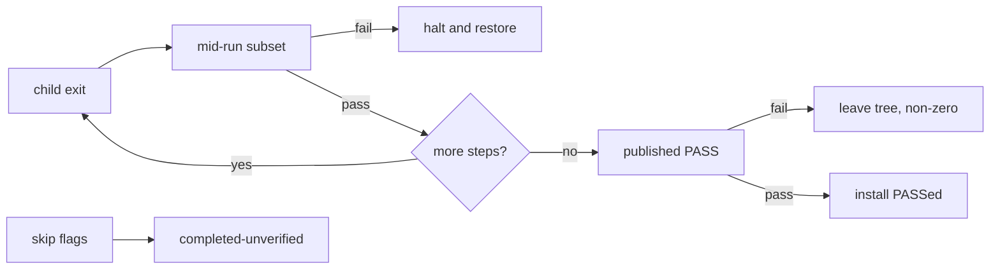
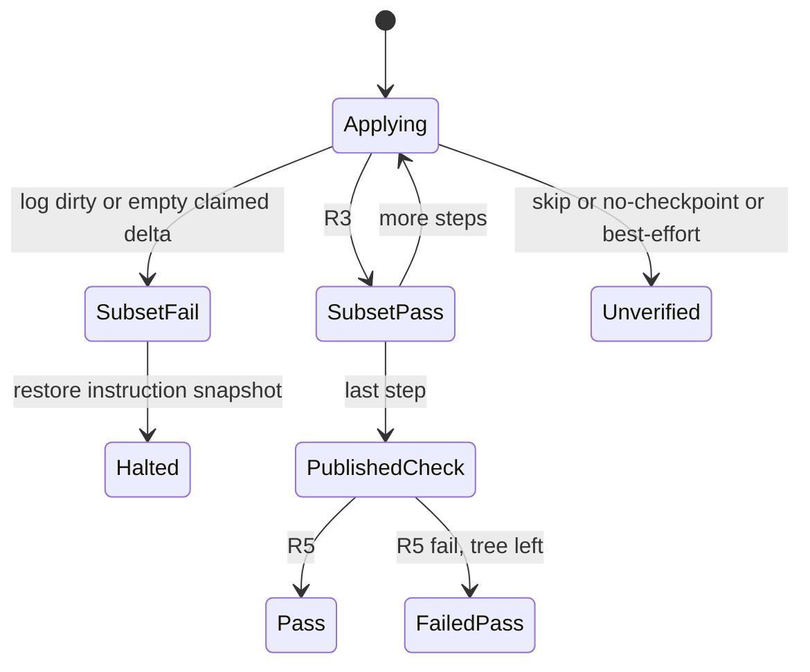
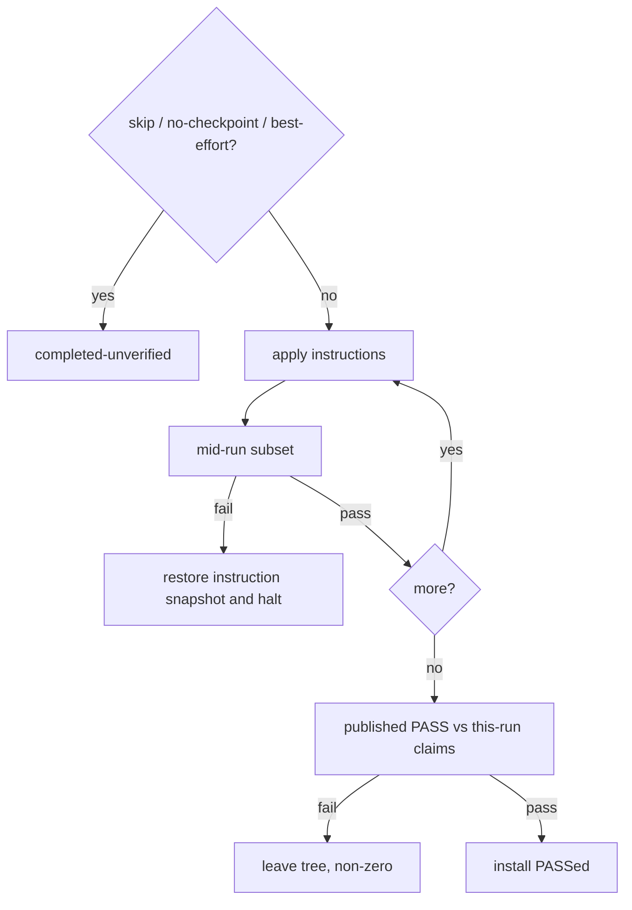

# Witness PASS Type - Plan

## Goal Capsule

**Objective:** Make install success a two-layer verdict — a mid-run fail-closed subset, and a published install PASS — shared by CLI and the wizard, default on for every install.

**Product authority:** This plan owns what “green” means after files are applied. It does not own DryRun/ValidatePage identity, download acquisition, generation-store rollback as the filesystem, Linux Holo hang classification, or `full.md` sentence grammar.

**Open blockers:** None.

Product Contract unchanged.

## Product Contract

### Summary

Every CLI and wizard install reports success only when a published install PASS holds. Mid-run step greens are a cheaper subset that can still halt the run. A skip flag may finish work; it may not say the install PASSed.

### Problem Frame

Patcher children routinely exit 0 while writing errors, changing nothing, or writing outside the claimed surface. Today `ActionExitCode.Success` and component `Succeeded` can follow that heartbeat. Operators already refuse to trust a tree until an external semantic differ says so. The wizard and CLI can both look finished while that differ still lives outside the product.

### Key Decisions

- **Two-layer verdict, not end-only and not full four-clause on every step.** Mid-run is log + scoped game-tree delta. Published PASS is the four-clause plus resource identity. `(session-settled: user-approved — chosen over end-only PASS with mid-run heartbeat, and over full four-clause every step: end-only left the Installing lie in place; full per-step was more than the smallest trusted ship.)` Governs R3, R5, R6, R12.
- **CLI and wizard share one PASS type, default on.** `(session-settled: user-directed — chosen over CLI-only, end-of-install-only, and operator-only: anyone who installs should stop needing an external differ to know if the product believes the tree.)` Governs R1, R2.
- **Default expected set is this run, not an oracle tree.** `(session-settled: user-directed — chosen over oracle-required and dropping the resource clause: a wizard user has no K1_manual; oracle compare is a parity mode of the same type.)` Governs R7, R8.
- **Failed published PASS leaves the tree.** `(session-settled: user-directed — chosen over auto-restore pre-install: the end verdict is not a time machine; restore stays a separate action.)` Governs R10.
- **Skip / no-checkpoint / best-effort cannot emit PASS.** `(session-settled: user-approved — chosen over keeping today’s Success, and over banning the flags: they may finish; the result is completed-unverified.)` Governs R9.

### How This Work Fits Together

<!-- ce-section: work-relationships -->

This plan owns Witness PASS only. The surrounding 2026-08-31 ideation set is the current understanding, not a roadmap.

- DryRun identity split — `Can proceed independently of` this plan. Shares the word “validate”; must not share a green badge with published PASS.
- Guide-as-source + digest expiry — `Can proceed independently of` this plan.
- Generation store — `Enables` stronger mid-run restore; not required for PASS to exist.
- Honest download product — `Can proceed independently of` this plan.
- Linux Holo supervisor — `Shares` child-process honesty; supervisor names hung/dialog, PASS names whether the applied tree is a pass.
- `full.md` sentence-form grammar — `Can proceed independently of` this plan. Wrong claims fail PASS per R5; grammar is how claims get better.

Seeded from `docs/ideation/2026-08-31-open-ideation.html`, idea “Witness PASS type”.

### Actors

- A1. **Installer user** — runs CLI or the wizard and needs the same meaning of success.
- A2. **Operator / agent** — may add a second tree and use parity mode of the same type.
- A3. **Patcher child** — Holo, Ody, or KPatcher. Its exit code is never sufficient for PASS.

### Key Flows

- F1. **Mid-run subset fail.** **Trigger:** a game-tree mutation finishes. **Steps:** evaluate R3 (and R4 if empty). On fail, halt, restore that step’s prior state, do not continue, do not write install PASS. **Covers R3, R4, R12.**
- F2. **Published PASS after subset-green steps.** **Trigger:** the last in-scope instruction has a subset pass. **Steps:** evaluate R5 against this run’s claims and before/after (R7). On fail, F3. On pass, CLI summary and wizard Finished may say the install PASSed. **Covers R5, R6, R7, R1.**
- F3. **Published PASS fail.** **Trigger:** R5 fails. **Steps:** leave the tree, write the report, non-zero process / failed Finished. Restore is a separate action. **Covers R10, R6.**
- F4. **Skip flags.** **Trigger:** skip-validation, no-checkpoint, or best-effort is on. **Steps:** work may finish; result is completed-unverified; no PASS, no succeeded. **Covers R9.**
- F5. **Parity mode.** **Trigger:** the user supplies a second tree. **Steps:** same type as R5; packing-only bytes after semantic equality are pass-with-packing-dissent, not fail. **Covers R7, R8.**

### Requirements

**Default success**

- R1. An install reports success only when published install PASS holds. This is the default for every CLI and wizard install, not an opt-in strict mode.
- R2. CLI and the wizard consume the same PASS type and must not invent a shorter success.

**Mid-run subset**

- R3. After each instruction that mutates the game tree, the run fails closed unless the patcher/install log is clean when a log exists and the scoped game-tree delta is non-empty. Halt, restore that step, do not continue.
- R4. An empty scoped delta is allowed only for an explicit optional delete whose target is already absent, and for work that does not mutate the game tree (extract to scratch). A silent no-op Patcher, Move, or Copy that claimed files is a subset fail.
- R12. Mid-run UI and CLI step lines may show subset pass or fail. They must not say the install succeeded or PASSed.

**Published PASS**

- R5. Published install PASS holds only when all of these are true: process completed; logs that exist are clean; the accumulated scoped game-tree delta is non-empty; changes sit inside the run’s claimed surface; format-aware resource identity (GFF, 2DA, TLK, ERF contents; hash fallback only for NCS) agrees with this run’s claims and before/after snapshot.
- R6. A run whose every mid-run subset passed may still fail published PASS. That outcome is a failed install, not a warning.
- R7. The default expected set is this run’s instruction claims plus the pre-install snapshot. Comparing to a second tree (manual oracle, other engine) is a parity mode of the same type, not the player default.
- R8. On the default expected set, packing-only ERF/TLK byte drift after semantic equality is ignored. In parity mode it is pass-with-packing-dissent, never a fail and never a pass that hides a content mismatch.
- R11. Holo `--validate` / config syntax checks are not published PASS and must not fill R5.

**Flags and aftermath**

- R9. Skip-validation, no-checkpoint, and best-effort may finish applying files. They must emit completed-unverified. They must not emit PASS, succeeded, or a successful Finished.
- R10. When published PASS fails, leave the game folder, write the report, and fail the process. Do not auto-restore the pre-install snapshot.

**Log cleanliness**

- R13. “Log clean” means no Error / Unable / not-found markers except outcomes the guide already treats as intended (for example a guide-directed missing tslpatchdata delete). Intended markers do not satisfy R3 by themselves; scoped delta still applies.

### Acceptance Examples

- AE1. **When** a patcher exits 0 and the log contains `Error:` that is not an intended missing-source case, **then** mid-run subset fails, the run halts, and no install PASS is written. **Covers R3, R13.**
- AE2. **When** a component extracts an archive and emits no game-tree Move or Patcher, **then** mid-run subset fails as a silent no-op. **Covers R3, R4.**
- AE3. **When** every subset passed and published PASS finds a claimed Override file whose resource content does not match the claim, **then** the install is failed, the tree is left, and Finished/CLI must not say PASSed. **Covers R5, R6, R10, R12.**
- AE4. **When** the user did not supply a second tree and two `.mod` files differ only by packing after semantic equality, **then** published PASS may still hold. **Covers R7, R8.**
- AE5. **When** `--skip-validation` is set and the process finishes, **then** the result is completed-unverified, not Success or PASS. **Covers R9.**
- AE6. **When** CLI and the wizard run the same selected components, same game folder policy, and same flags, **then** they emit the same PASS or completed-unverified outcome. **Covers R2.**

### Success Criteria

- A heartbeat (child exit 0, or a green step line) cannot be the install verdict in CLI or the wizard.
- Operators can stop using an external differ as the only way to know whether this product believes the tree, unless they opted into completed-unverified.
- Parity nights can still compare to a second tree without changing the player default.

### Scope Boundaries

**In scope:** the install-success verdict after apply, for CLI and the wizard, including skip-flag honesty and a parity mode of the same type.

**Deferred:** DryRun / ValidatePage as a separate predicate; generation-store as the only filesystem; download acquisition; Linux Holo hang/dialog supervisor; `full.md` sentence-form grammar; making the oneshot ledger an installer input.

**Out of identity:** treating Holo `--validate` as content equality; requiring `K1_manual` for a normal player PASS; auto-wiping a tree because published PASS failed; byte-identity of packed ERF/TLK as the default bar.

### Outstanding Questions

- Deferred to Planning: exact helper names and how incremental hash capture is stored on the classic path.
- Deferred to Planning: exact CLI and Finished copy, as long as it cannot say succeeded or PASSed when R1 or R9 forbids it.

## Planning Contract

### Key Technical Decisions

- KTD1. **Add a witness verdict type; do not overload `ActionExitCode.Success`.** Mid-run subset and published PASS are new results on the pipeline/component outcome, not a new meaning of process success. Governs R1, R2, R9. `(session-settled: user-approved — chosen over stretching Success: CLI and wizard already treat Success as the install verdict.)`
- KTD2. **Mid-run fail-closed applies to Standard and Reference.** Today `failClosed` is Reference/Markdown only. R1 is every install, including wizard TOML. Governs R3.
- KTD3. **Restore the instruction, not only the component.** Snapshot or equivalent before each mutating instruction; on subset fail restore that point. `(session-settled: user-approved — chosen over accepting today’s per-component restore: R3 says restore that step.)` Governs R3, F1.
- KTD4. **Classic and managed share one capture seam.** Managed already has `CaptureGameFileHashIndexAsync` / `DiffGameFileHashIndexAsync`. Classic must use the same witness capture, not a second delta story. Governs R3, R5, R7.
- KTD5. **Published PASS runs only after a subset-clean batch.** If install already halted, do not invent an end PASS. If the batch would have been Success, evaluate R5; on fail leave the tree (R10). Governs R5, R6, F2, F3.
- KTD6. **Resource identity for published PASS is format-aware in this plan.** Byte SHA-256 is not enough for GFF/2DA/TLK/ERF. Reuse the approach in `scripts/diff_kotor_installs.py` from Core, not as a Python child. `(session-settled: user-approved — chosen over a hash-only stub: a stub makes R5 decorative.)` Governs R5, R8.

### Assumptions

- Intended log markers beyond guide-directed tslpatchdata delete stay on the existing `IsGuideDirectedTslPatchdataDeleteOutcome` path until a later discovery pass (R13).
- Widescreen install uses the same pipeline result as the base wizard; no separate PASS type.
- Legacy `MainWindow` install path must consume the same pipeline result or be left unable to claim PASS.

### High-Level Technical Design

Two layers, one pipeline result. ValidatePage remains a different predicate.

### System-Wide Impact

CLI exit codes, wizard forward-nav, Finished/BaseInstallComplete copy, and `MockInstallIntegrationTests` currently treat skip/no-checkpoint plus exit 0 as success. All four must change together or CLI/GUI will diverge (R2).

### Sequencing

U1 types first. U2 mid-run + restore. U3 published PASS. U4 CLI. U5 wizard. U6 locks AE5/AE6 so skip-flag tests cannot regress.

## Implementation Units

### U1. Witness verdict types on the shared pipeline result

**Goal:** CLI and GUI have one object that can be PASS, failed PASS, subset halt, or completed-unverified.

**Requirements:** R1, R2, R9, R12. KTD1.

**Dependencies:** None.

**Files:**
- `src/ModSync.Core/Services/Installation/InstallationPipelineService.cs`
- `src/ModSync.Core/ModComponent.cs` (InstallExitCode)
- `src/ModSync.Tests/InstallationPipelineServiceTests.cs`

**Approach:**
1. Add published/mid-run/unverified fields on `InstallationPipelineResult` (or a sibling type it owns). Do not reuse `ValidationResult.IsSuccess` for PASS.
2. Add `CompletedUnverified` (or equivalent) to `InstallExitCode`. `Succeeded` must be false unless published PASS holds.
3. Keep `ActionExitCode.Success` as instruction-process success only.

**Execution note:** Start with failing pipeline tests for “Success no longer follows skip-validation.”

**Patterns to follow:** Existing `InstallationPipelineResult.Succeeded` composition in `InstallationPipelineService.cs`.

**Test scenarios:**
- Happy path: subset-clean batch + published PASS → `Succeeded` true, exit Success.
- Edge: skip-validation finish → CompletedUnverified, `Succeeded` false. Covers AE5.
- Error: published PASS fail after Success-shaped batch → failed install, `Succeeded` false. Covers AE3.
- Integration: Reference and Standard requests both expose the same verdict fields.

**Verification:** No caller can treat `InstallExitCode.Success` as PASS without the new fields.

### U2. Mid-run subset and instruction-level restore

**Goal:** A dirty log or empty claimed game-tree delta halts the run and restores the pre-instruction snapshot on every install mode.

**Requirements:** R3, R4, R13, F1. KTD2, KTD3, KTD4.

**Dependencies:** U1.

**Files:**
- `src/ModSync.Core/Instruction.cs`
- `src/ModSync.Core/Services/InstallationService.cs`
- `src/ModSync.Core/Services/Checkpoints/CheckpointPaths.cs` (or equivalent snapshot helper)
- `src/ModSync.Core/Services/Deployment/DeploymentService.cs`
- `src/ModSync.Core/Services/Installation/ManagedInstallSession.cs`
- `src/ModSync.Tests/InstructionExecutionTests.cs`
- `src/ModSync.Tests/InstallationPipelineServiceTests.cs`
- `src/ModSync.Tests/CheckpointAndResumeComprehensiveTests.cs`

**Approach:**
1. After each game-tree mutation, require log-clean-when-present (reuse `VerifyInstall` + intended-delete filter) and a non-empty scoped delta for claimed Patcher/Move/Copy.
2. Allow empty delta only per R4.
3. Capture a restore point before the instruction; on fail call that restore, not only `RestoreFailedComponentAsync`.
4. Enable fail-closed subset for Standard as well as Reference.
5. Use one capture seam for classic and managed (extend hash index so classic is not skipped).

**Execution note:** Add characterization coverage around `VerifyInstall` and `RestoreFailedComponentAsync` before changing restore grain.

**Patterns to follow:** `Instruction.VerifyInstall`, `IsGuideDirectedTslPatchdataDeleteOutcome`, `InstallationPipelineServiceTests.FailClosedExecution_RuntimeFailure_RestoresThePreComponentSnapshot`.

**Test scenarios:**
- Happy path: patcher with clean log and Override files added → subset pass.
- Edge: optional delete of a missing file → empty delta allowed. Covers R4.
- Error: exit 0 plus `Error:` in installlog → subset fail, halt, snapshot matches pre-instruction. Covers AE1.
- Error: extract-only, no Move/Patcher → subset fail. Covers AE2.
- Integration: Standard (TOML) mode also restores and does not continue.

**Verification:** A silent no-op cannot complete a component as Success.

### U3. Published PASS against this-run claims

**Goal:** After a subset-clean batch, evaluate R5; packing-only drift does not fail the default expected set.

**Requirements:** R5, R6, R7, R8, R11, F2, F3. KTD5, KTD6.

**Dependencies:** U1, U2.

**Files:**
- `src/ModSync.Core/Services/Installation/` (new witness/compare service)
- `src/ModSync.Core/Services/Installation/InstallationPipelineService.cs`
- `scripts/diff_kotor_installs.py` (behavior reference only)
- `src/ModSync.Tests/MockKotorInstallTests.cs` (or a new focused test class next to it)

**Approach:**
1. Expected set = instruction claims + pre-install snapshot (R7). No oracle required.
2. Compare GFF/2DA/TLK/ERF by resource content; NCS by hash fallback (R5).
3. Default: ignore packing-only after semantic equality (R8).
4. Parity mode (second tree supplied) is the same type with pass-with-packing-dissent.
5. Do not call Holo `--validate` as this check (R11).
6. On fail, do not restore (R10).

**Patterns to follow:** `scripts/diff_kotor_installs.py` `reordered_only`; oneshot packing note for `.mod` resource sets.

**Test scenarios:**
- Happy path: claimed files match structurally → published PASS.
- Edge: `.mod` packing/order differs, resources identical → PASS on default set. Covers AE4.
- Error: claimed Override content mismatches → failed PASS, tree left. Covers AE3.
- Integration: pipeline does not run published PASS if subset already halted.

**Verification:** A subset-green run can still fail published PASS without wiping the folder.

### U4. CLI exit and copy

**Goal:** CLI exit 0 and “succeeded” only follow published PASS.

**Requirements:** R1, R2, R9, F4. KTD1.

**Dependencies:** U1, U2, U3.

**Files:**
- `src/ModSync.Core/CLI/ModBuildConverter.cs`
- `src/ModSync.Tests/MockInstallIntegrationTests.cs`
- `src/ModSync.Tests/CliInstallIntegrationTests.cs` (if present and asserting exit 0 on skip)

**Approach:**
1. Map published PASS → exit 0.
2. Map CompletedUnverified and failed PASS → non-zero.
3. Best-effort / skip / no-checkpoint must not take the current exit-0 shortcuts.

**Execution note:** Update `MockInstallIntegrationTests` in the same unit as the CLI change so skip/no-checkpoint cannot stay green.

**Patterns to follow:** Existing exit switch around `ModBuildConverter` install result (Success vs CompletedWithFailures).

**Test scenarios:**
- Happy path: full PASS → exit 0 and PASS wording.
- Error: `--skip-validation --no-checkpoint` → non-zero, completed-unverified. Covers AE5.
- Integration: `--best-effort` finish is unverified, not Success.

**Verification:** The oneshot-style skip command cannot print install success.

### U5. Wizard Installing and completion pages

**Goal:** Forward-nav and completion copy follow the same verdict as CLI.

**Requirements:** R1, R2, R9, R12, F2, F3, F4. A1.

**Dependencies:** U1, U2, U3.

**Files:**
- `src/ModSync.GUI/Dialogs/WizardPages/InstallingPage.axaml.cs`
- `src/ModSync.GUI/Dialogs/WizardPages/BaseInstallCompletePage.axaml.cs`
- `src/ModSync.GUI/Dialogs/WizardPages/FinishedPage.axaml.cs`
- `src/ModSync.GUI/Dialogs/WizardPages/WidescreenInstallingPage.axaml.cs`
- `src/ModSync.Tests/HeadlessUITests/GuiSmokeHeadlessTests.cs`

**Approach:**
1. Drive `_canNavigateForward` and completion strings from pipeline witness fields, not `Succeeded` as it exists today.
2. Subset-green step lines must not say the install PASSed (R12).
3. Failed PASS: allow the user to see the report; do not say the base install finished successfully.
4. Do not change ValidatePage badges.

**Patterns to follow:** `InstallingPage` pipeline request construction; keep Markdown → Reference, TOML → Standard, but both honor U2 fail-closed.

**Test scenarios:**
- Happy path: PASS → Installing may advance; completion page may say PASSed.
- Error: failed PASS → no “finished successfully” on BaseInstallComplete. Covers AE3.
- Integration: CLI and wizard same inputs → same PASS vs unverified. Covers AE6.
- Headless: Finished/BaseInstallComplete still present; copy path does not crash.

**Verification:** A wizard TOML install cannot show success when published PASS failed.

### U6. Skip-flag and parity regression net

**Goal:** Existing tests that treat heartbeat or skip as success are rewritten to the new contract.

**Requirements:** R2, R9, AE5, AE6.

**Dependencies:** U4, U5.

**Files:**
- `src/ModSync.Tests/MockInstallIntegrationTests.cs`
- `src/ModSync.Tests/InstallationPipelineServiceTests.cs`
- `src/ModSync.Tests/ValidationPipelineParityTests.cs` (assert validation green ≠ PASS)

**Approach:**
1. Rewrite skip/no-checkpoint expectations to CompletedUnverified.
2. Keep validation-parity tests on DryRun; add an assertion they are not install PASS.
3. Do not add LongRunning full-build tests in this plan.

**Test scenarios:**
- Happy path: Reference reject of skip flags unchanged where it already rejects.
- Integration: Standard + skip → unverified, not Success. Covers AE5.
- Integration: validation IsSuccess with skipped apply still not PASS.

**Verification:** `dotnet test` filters in the Verification Contract pass.

## Verification Contract

Run from repo root. Do not use the PowerShell duration wrapper unless classifying a single new test.

- `dotnet test src/ModSync.Tests/ModSync.Tests.csproj --filter "FullyQualifiedName~InstallationPipelineServiceTests" --configuration Debug`
- `dotnet test src/ModSync.Tests/ModSync.Tests.csproj --filter "FullyQualifiedName~InstructionExecutionTests|FullyQualifiedName~MockInstallIntegrationTests" --configuration Debug`
- `dotnet test src/ModSync.Tests/ModSync.Tests.csproj --filter "FullyQualifiedName~CheckpointAndResumeComprehensiveTests" --configuration Debug`
- `./scripts/agents/run_headless_tests.sh --filter "FullyQualifiedName~GuiSmokeHeadlessTests"`

Quality gates: no new test over ~2 minutes without a `LongRunning` suffix; no ValidatePage badge reuse for PASS; CLI and wizard same verdict for same inputs.

## Definition of Done

- R1–R13 and AE1–AE6 are implemented or explicitly deferred with a U-ID note (none deferred except helper names and exact CLI/Finished copy per Outstanding Questions).
- `InstallationPipelineResult.Succeeded` is true only when published PASS holds.
- Skip / no-checkpoint / best-effort cannot exit 0 as Success.
- Mid-run subset fail restores the pre-instruction snapshot and does not continue.
- Published PASS fail leaves the tree and fails the process.
- Product Contract IDs are unchanged.
- Verification Contract commands pass.

### Deferred to Follow-Up Work

- DryRun / ValidatePage identity split (ideation idea 2).
- Generation store, download honesty, Holo supervisor, sentence grammar.
- Making `docs/solutions` the home for a Witness PASS postmortem after ship.
